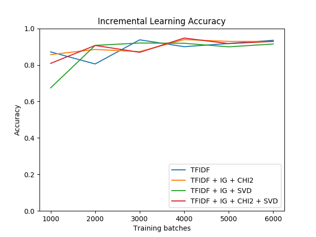
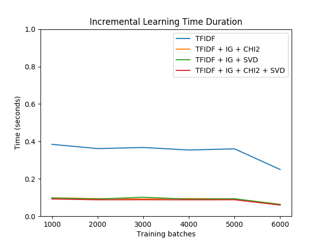
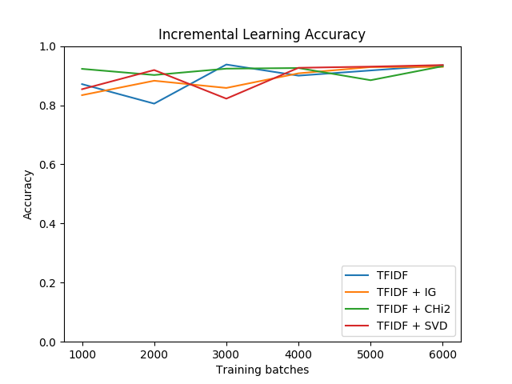
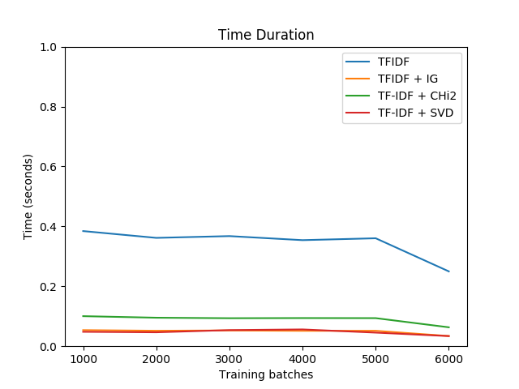

# Feature Engineering Techniques in Online / Incremental Learning

## Definition
Online learnning is a medthod of machine learning where data becomes available in sequential order and is used to update our best predictor for future data at each step as opposed to batch learning techniques which generates best predictor by learning on the entore training datasets at once.

## Advantages
1. Online learning is used when it is computational infeasible to train the entire datasets, requiring the need of algorithim that can process data that are too large to fit in the computer memory at a time.

2. It is used when it is neccessary for the algorithm to dynamically adapt to new patterns in the data, or when when the data itself is generated as a function in time, e.g stock price prediction

## Dependencies
1. Pandas
2. Numpy
3. Matplotlib
4. Sklearn

## Usage
1. Pull the repository to a location of your choice on your local system

2. Open a terminal on your system and change directory to the project.

3. Run the model by running this command `python model.py` on the terminal.

## Result

1. Accuracy for a combined feature enginnering model.

2. Time complexity for a combined feature enginnering model.

3. Accuracy for a fixed feature enginnering model.

4. Time complexity for a fixed feature enginnering model.

## Credit
